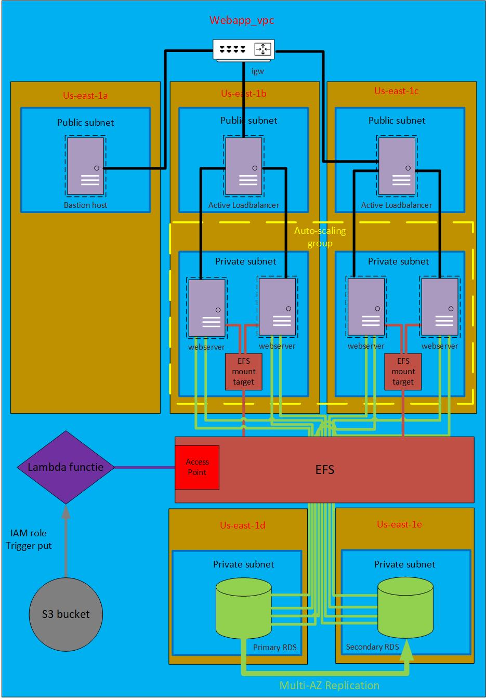

# CloudAndAutomation

## Permanente Evaluatie Cloud And Automation
  

    

### Opbouw infrastructuur
 

- **Bastion host** (vanuit deze machine kan men ssh'en naar de webservers)
- Active-active **loadbalancer**
- **auto-scaling group**
- **Webservers** in auto-scaling group
- **S3 bucket**
- **Lambda functie** (schrijft de namen van images die geüpload worden op de s3 bucket naar een file in de EFS)
- **EFS** verbonden met webservers (via mount targets) en lambda functie (via access point)
- Multi-AZ **RDS**